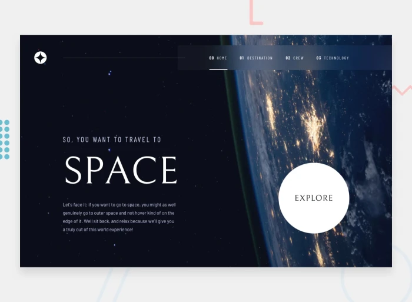
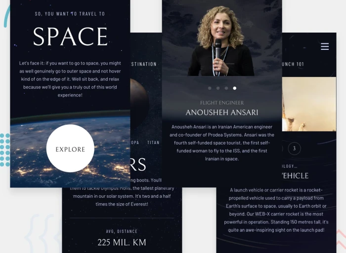

# Frontend Mentor - Space tourism website

This is a solution to the [Space tourism website challenge on Frontend Mentor](https://www.frontendmentor.io/challenges/space-tourism-multipage-website-gRWj1URZ3). Frontend Mentor challenges help you improve your coding skills by building realistic projects. 

## Table of contents

- [Overview](#overview)
  - [The challenge](#the-challenge)
  - [Screenshot](#screenshot)
  - [Links](#links)
- [My process](#my-process)
  - [Built with](#built-with)
  - [What I learned](#what-i-learned)
  - [Continued development](#continued-development)
- [Author](#author)

## Overview

### The challenge

Users should be able to:

- View the optimal layout for each of the website's pages depending on their device's screen size
- See hover states for all interactive elements on the page
- View each page and be able to toggle between the tabs to see new information

### Screenshot

|  |  |
| :--: | :--: |
| Desktop | Mobile |

### Links

- Solution URL: [Frontend Mentor](https://www.frontendmentor.io/solutions/space-tourism-multi-page-website-YJE1fOp1JY)
- Live Site URL: [GitHub Pages](https://rahulpaul127.github.io/space-tourism-multipage-website/)

## My process

### Built with

- Semantic HTML5 markup
- CSS custom properties (design tokens)
- CSS Flexbox & CSS Grid
- Mobile-first responsive workflow
- Vanilla JavaScript for interactivity
- Single Page Application (SPA) architecture using vanilla JS

### What I learned

During this project, I gained significant experience in several key areas:

- **Single Page Application (SPA) Architecture:** I implemented a custom routing system using vanilla JavaScript that dynamically updates the DOM based on the selected navigation link. This provides a seamless transition between pages without needing full page reloads.

- **Asynchronous Data Fetching:** I learned how to fetch and parse data from a local `data.json` file asynchronously using `async/await` and the Fetch API, which was then used to populate the content for the Destination, Crew, and Technology sections dynamically.

- **Advanced CSS Grid Layouts:** I utilized CSS Grid extensively, specifically relying on `grid-template-areas` to restructure complex layouts from mobile to desktop screens cleanly.

```css
@media (min-width: 45em) {
  .grid-container--destination {
    grid-template-areas: 
      '. title title .'
      '. image tabs .'
      '. image content .';
  }
}
```

- **Accessible Tab Interfaces:** I built interactive tabbed interfaces for the sub-pages (e.g., destinations, crew members) using proper accessibility attributes like `role="tablist"`, `role="tab"`, and `aria-selected` to ensure screen readers can understand the interactive state.

- **Design Systems with CSS Variables:** I set up a robust design system using CSS custom properties for typography, colors, and layout spacing, which made it extremely easy to maintain consistency across the entire application.

### Continued development

- **Animations and Transitions:** I'd like to add smoother page transitions between the different sections (Home, Destination, Crew, Technology) when navigating.
- **Accessibility Improvements:** I want to continue refining the keyboard navigation, specifically managing focus when switching between different tabs and routes.
- **Preloading Images:** Exploring ways to preload images for the destination and crew tabs to prevent any slight flickering when users click a tab for the first time.

## Author

- Frontend Mentor - [@rahulpaul127](https://www.frontendmentor.io/profile/rahulpaul127)
- Twitter - [@rahulpaul127](https://x.com/rahulpaul127)
